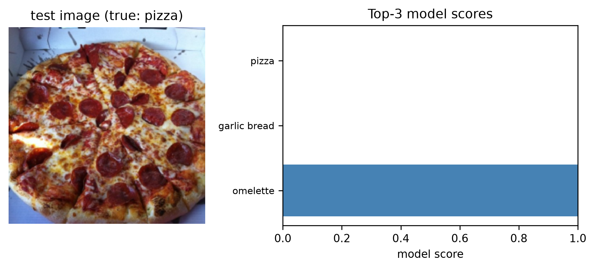
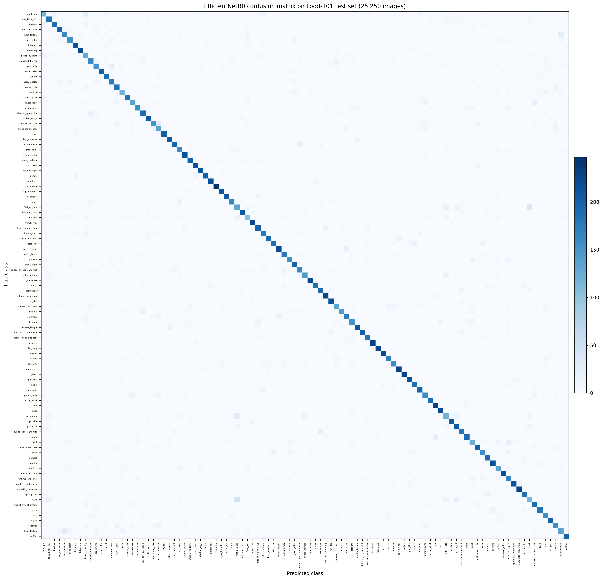
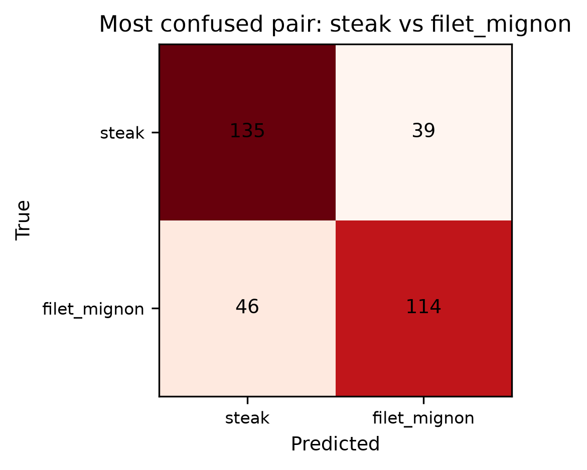
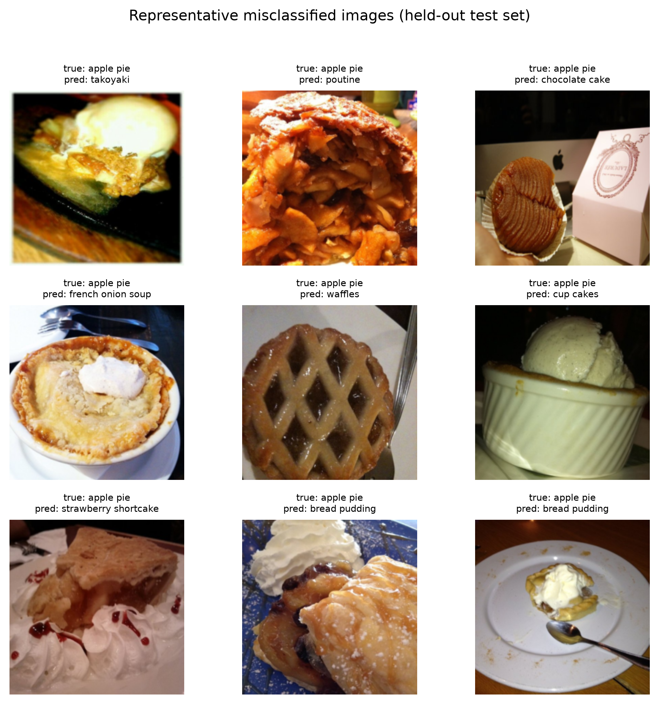
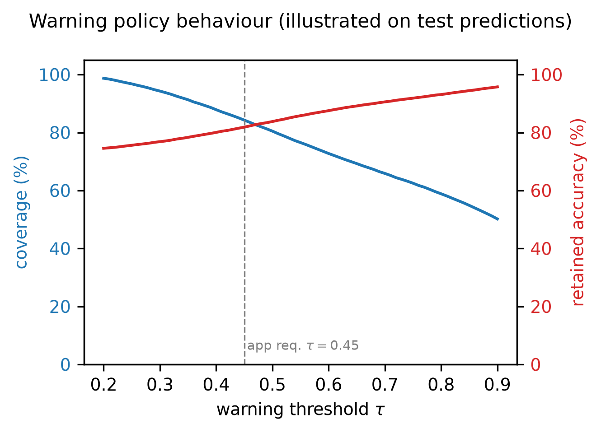

# FoodLens: Smart Food Recognition Using Deep Learning with Top-3 Predictions and Ingredient Information

**Authors:** Sarthak Kulkarni, Harshad Patekar, Tanay Shinde, Yash Patil

Department of Information Technology — Deep Learning Lab Project (Semester VII), Academic Year 2026–27
Project Guide: Dr. Sushopti Gawade

> This file is a Markdown rendering of the IEEE paper (`paper/main.tex`), organised by the paper's sections only.
> Every numerical result is taken from the recorded experiment outputs of the FoodLens project. Values that are not yet
> available are explicitly marked **[pending]**. No result has been invented.

---

## Abstract

FoodLens is an image-based food recognition prototype for the food image classification task. It compares five convolutional neural network (CNN) architectures — a custom CNN trained from scratch and four ImageNet-pretrained models (ResNet50, MobileNetV2, DenseNet121, EfficientNetB0) — on the Food-101 benchmark under a common experimental protocol. The application recognises the dominant dish in an uploaded photograph, displays the three highest-scoring food categories together with their model scores, and retrieves curated ingredient information from a separate lookup table. Ingredient suggestions describe common recipe ingredients; they are not presented as image-verified content. The intended contribution is integration and reproducible evaluation of existing architectures rather than a new neural design. To date, the full 101-class training has been completed for the deployed EfficientNetB0 model, which achieves **73.85% Top-1, 88.44% Top-3, and 92.65% Top-5 accuracy**, a **macro F1 of 73.74%**, and a measured batched inference time of **6.6 ms per image** in the recorded evaluation on the 25,250-image held-out test set. Comparisons with the remaining four models are reported as pending because their full 101-class runs have not yet completed.

**Keywords:** food recognition, deep learning, Food-101, convolutional neural network, transfer learning, image classification, ingredient information.

---

## I. Introduction

Food recognition from ordinary photographs is difficult. The same dish can look very different across restaurants, plating styles, lighting, and camera angles, while different dishes frequently share similar colours, textures, and compositions [1, 3]. These properties make food a challenging fine-grained visual recognition problem and a useful test bed for comparing deep learning solutions.

This paper presents FoodLens, a semester project that studies these challenges through a controlled comparison of five CNN architectures on the Food-101 dataset [4]. The project builds a reproducible pipeline that (i) prepares fixed training, validation, and test partitions, (ii) trains a custom CNN from scratch and four ImageNet-pretrained backbones with a shared classifier head, (iii) selects a deployment model using validation data only, and (iv) evaluates the locked model on the untouched held-out test set. The application layer accepts a single food photograph, returns Top-3 category predictions with scores, flags low-score predictions, and retrieves curated dish-to-ingredient information.

A deliberate design decision separates prediction from information: category scores are produced by the learned model, whereas ingredient suggestions come from a manually curated lookup table and therefore describe *common recipe ingredients*, never ingredients "detected" in the photograph. This separation avoids overstating what a classifier can infer from pixels.

The project compares five deep learning architectures:

1. a custom CNN trained from random initialization (baseline);
2. ResNet50 [6];
3. MobileNetV2 [6];
4. DenseNet121 [6];
5. EfficientNetB0 [6].

All five solve the same 101-class problem; they are alternatives and are never ensembled. The contribution is integration and evaluation of existing, well-established architectures on a shared, audited pipeline rather than a new neural architecture or a medical/nutrition tool.

The rest of the paper is organised as follows. Section II reviews related work. Section III describes the dataset and preprocessing. Section IV presents the methodology. Section V details the five models. Section VI describes the experimental setup. Section VII reports results, followed by the application in Section VIII, limitations in Section IX, and conclusions in Section X.

---

## II. Related Work

**Suddul and Seguin [1]** compared a CNN trained from scratch with a transfer-learning approach for food classification using image augmentation and EfficientNetV2 on a small set of food groups. Their study supports the baseline-versus-transfer experimental design used here; however, their task uses eleven food groups rather than the 101-class Food-101 problem.

**Abiyev and Adepoju [2]** combined CNNs with a self-attention mechanism and an averaged ensemble of predictions and evaluated on Food-101 and MA Food-121. Their work motivates the analysis of confusing, visually similar classes that we carry out in Section VII; attention mechanisms and ensembling remain outside the scope of this project.

**Razia Sulthana et al. [3]** addressed fine-grained food image classification and recipe extraction using a customized residual network together with NLP and a domain ontology for ingredient and recipe processing. That work motivates the separate information layer in FoodLens; our curated lookup reproduces its behaviour only to the extent of mapping a predicted dish to common recipe ingredients, and we do not claim to implement its NLP pipeline.

**Bossard et al.** introduced Food-101, a public 101-class food benchmark, in [4]. The dataset is described in detail in Section III.

We distinguish clearly between this prior research and our experimental work. The cited papers provide methodology and motivation; none of their reported numbers is reproduced or claimed as our own result.

---

## III. Dataset and Preprocessing

Food-101 [4, 5] contains 101,000 images across 101 food categories, with 1,000 images per category. The official distribution splits each category into 750 training images and 250 manually reviewed test images. Training images intentionally include some noise, including incorrect labels. Images have a maximum side length of 512 pixels. Table I summarises the dataset parameters used in this project.

**Table I: Dataset parameters used in FoodLens.**

| Parameter | Value |
|---|---|
| Number of classes | 101 |
| Images per class | 1,000 |
| Official train images per class | 750 |
| Official test images per class | 250 |
| Planned train images per class | 600 |
| Planned validation images per class | 150 |
| Test images per class | 250 |
| Input size | 224 × 224 × 3 |

**Partitioning policy.** The project synopsis specifies that a validation set must be drawn *only* from the official training images, aiming for 600 training and 150 validation images per class, while the official 250-image test set remains untouched during development. This per-class scheme was implemented and validated for the fixed 20-class development subset (Section VI), producing 12,000, 3,000, and 5,000 images for training, validation, and test, respectively, with full class membership, disjointness, determinism, and shape checks passing.

For the full 101-class production run, the training record (Section VI) used a global random 85/15 split of the official training set into training (≈63,750 images) and validation (≈11,250 images), and evaluated on the official 25,250-image test set. This deviation from the per-class scheme is documented in Section VI; it affects the development-time protocol but does not touch the test set, which was used exactly once for final evaluation.

**Preprocessing.** Every image is decoded to RGB and resized to 224×224. Backbone-specific preprocessing (`keras.applications.*.preprocess_input`) is applied per model where the recorded pipeline requires it. Random augmentation is applied to training images only:

- random horizontal flip,
- random rotation (±0.1 rad),
- random zoom (factor 0.1).

Validation and test preprocessing are deterministic; no augmentation is applied to them. A fixed random seed (42) is used throughout.

---

## IV. Proposed Methodology

Figure 1 shows the end-to-end workflow. Test data are deliberately excluded from every development step: validation alone is used for model selection and for threshold selection, and the evaluation configuration is frozen before the held-out test evaluation runs.

```
Food-101 images → data audit & fixed split → resize & backbone              ┐
   preprocessing; training-only augmentation → train five candidate models  ├– validation only
   (Custom CNN + four pretrained CNNs) → validation-based model selection   │
   & threshold selection → freeze model/preprocessing/class map/threshold   ┘
→ held-out test evaluation (official 25,250 images) → FoodLens web app
   (Top-3 scores + warning + ingredient lookup)
```

**Fig. 1.** Training and inference workflow. Test data never guide model selection in FoodLens.

The processing steps are:

1. *Prepare data*: establish the shared split and preprocessing pipeline.
2. *Train candidates*: fit the custom CNN; train new classification heads on frozen pretrained backbones, then fine-tune selected upper layers.
3. *Select and evaluate*: select the deployment model using validation Top-1 accuracy, with inference time as the tie-breaker; lock all choices before final testing.
4. *Deploy*: accept valid JPG/PNG uploads and run the saved inference pipeline.
5. *Present results*: display the Top-3 scores and retrieve common ingredients only when the prediction is not flagged as low-score.

---

## V. Deep Learning Models

All five models solve the same 101-class classification problem. The four pretrained architectures are taken from Keras Applications [6]. For each pretrained model the original classifier is replaced by a project-specific head (Fig. 2). The models are comparison alternatives; they are not chained or ensembled.

```
Input 224×224×3 → backbone-specific preprocessing → selected CNN backbone
   → global average pooling → Dense(128, ReLU) → Dropout(0.3)
   → Dense(101, Softmax) → Top-3 classes and model scores
```

**Fig. 2.** Project-specific architecture for each transfer-learning experiment. The custom CNN uses the same head structure applied to its feature map.

**A. Custom CNN** — A baseline network trained from random initialization with three convolution–ReLU–max-pooling blocks (32, 64, and 128 filters of size 3×3), global average pooling, a 128-unit dense layer with ReLU, dropout 0.3, and a 101-way softmax head. It is the baseline against which the transfer-learning models are compared.

**B. ResNet50** — Residual connections pass features through shortcut paths, providing a strong baseline for transfer learning on food imagery.

**C. MobileNetV2** — Inverted residual blocks and depthwise convolutions provide efficient feature extraction, evaluating the accuracy–latency trade-off for a lightweight demonstration.

**D. DenseNet121** — Dense connectivity reuses features from earlier layers, comparing densely connected feature learning with residual learning.

**E. EfficientNetB0** — A compact convolutional backbone from the EfficientNet family designed around balanced network scaling, evaluated as the deployment model of the current prototype.

For the completed EfficientNetB0 run, the head that is

```
features → Dense(128, ReLU) → Dropout(0.3) → Dense(101, softmax)
```

becomes, per image x with logits z_c and true label y,

```
p_c(x) = exp(z_c) / Σ_j exp(z_j),   ℒ(x, y) = −log p_y(x)
```

---

## VI. Experimental Setup

**Configuration.** The initial settings follow the project synopsis: Adam optimizer, batch size 32, learning rate 10⁻³; up to five frozen-backbone epochs followed by up to fifteen fine-tuning epochs at 10⁻⁵ for transfer models, and up to twenty training epochs for the custom CNN. Early stopping monitors validation loss with patience three and restores the best checkpoint. Pre-trained batch-normalization statistics remain frozen during the frozen stage.

The recorded production run for EfficientNetB0 (`training_food101.ipynb`) documented the following modifications, which we report rather than silently apply:

- batch size 16 (reduced from 32 for memory),
- mixed-precision training (`mixed_float16`),
- Phase 1 (frozen backbone): up to 10 epochs, Adam at 10⁻³ (≈ head-only training; early stopping on validation accuracy, patience 3, restore best),
- Phase 2 (fine-tuning): last ≈20 backbone layers unfrozen, Adam at 10⁻⁵, early stopping (patience 2) and `ReduceLROnPlateau` on validation loss,
- input preprocessing: JPEG decode → bilinear resize to 224×224 → float32 pixels in [0, 255], no extra normalization (rather than the `preprocess_input` scaling).

**Development subset and smoke runs.** Following the synopsis, a fixed 20-class subset (with the per-class 600/150/250 split) was used for pipeline debugging. Batch 13 ran one-epoch *smoke* training for all five architectures on a 16-batch slice of that subset to verify the pipeline end-to-end; Table II records these measured feasibility runs. They are debugging runs, not benchmark results.

**Table II: Measured one-epoch pipeline smoke runs (Batch 13, 20-class development subset, 16 training batches per model). These are feasibility checks and are not presented as comparisons.**

| Model | Total parameters | Elapsed (s) |
|---|---|---|
| CustomCNN | 95,828 | 7.8 |
| ResNet50 | 23,628,692 | 219.2 |
| MobileNetV2 | 2,283,604 | 185.2 |
| DenseNet121 | 7,058,004 | 657.1 |
| EfficientNetB0 | 4,075,191 | 244.3 |

**Recorded metadata.** The pipeline records the random seed, dataset paths, image size, batch size, learning rates, epoch limits, augmentation parameters, model names, output directories, and split manifests (`train.csv`, `val.csv`, `test.csv`) with class labels. TensorFlow/Keras and Python versions, GPU information, and package versions are recorded in experiment metadata.

**Algorithm 1: FoodLens model training and evaluation**

1. Load official Food-101 training and test partitions.
2. Split the training partition into training and validation sets (fixed seed).
3. Apply model-specific preprocessing; augment training images only.
4. Train Custom CNN from scratch.
5. Train ResNet50; train MobileNetV2; train DenseNet121; train EfficientNetB0 (frozen-backbone stage then fine-tuning).
6. Evaluate all models on validation data.
7. Select the deployment model using validation Top-1 accuracy.
8. Freeze model, preprocessing, class mapping, and threshold.
9. Evaluate all locked models on the untouched test set.
10. Generate Top-1 and Top-3 metrics, confusion matrix, and error analysis.
11. Export the selected model and deploy it in the FoodLens application.

---

## VII. Results and Discussion

Unless stated otherwise, all reported numbers below come from the recorded evaluation of the deployed EfficientNetB0 model on the official held-out test set of 25,250 images (`foodlens2/results/food101_eval.json` and the metrics computed from the cached prediction outputs of that run). No value has been estimated or invented. The full 101-class runs of the remaining four models have not yet been completed; their entries are explicitly marked **[pending]** and will be filled from future recorded evaluations.

### A. Classification Performance

Table III reports the held-out test metrics of the deployed model, with Top-1 accuracy as the primary comparison metric. Macro precision/recall/F1 average the per-class scores and expose uneven performance; Table IX (Appendix) lists per-class values.

**Table III: Held-out test performance of the deployed EfficientNetB0 model (test set: 25,250 images).**

| Metric | Value |
|---|---|
| Top-1 accuracy | 73.85% |
| Top-3 accuracy | 88.44% |
| Top-5 accuracy | 92.65% |
| Macro precision | 73.82% |
| Macro recall | 73.85% |
| Macro F1 | 73.74% |

The full comparison table (Table IV) lists the planned per-model entries; only the EfficientNetB0 row currently contains measured values.

**Table IV: Planned cross-model held-out test comparison. Only rows with recorded values are filled; other rows are **[pending]**.**

| Model | Top-1 | Top-3 | Prec | Rec | F1 |
|---|---|---|---|---|---|
| Custom CNN | [pending] | [pending] | [pending] | [pending] | [pending] |
| ResNet50 | [pending] | [pending] | [pending] | [pending] | [pending] |
| MobileNetV2 | [pending] | [pending] | [pending] | [pending] | [pending] |
| DenseNet121 | [pending] | [pending] | [pending] | [pending] | [pending] |
| EfficientNetB0 | 73.85% | 88.44% | 73.82% | 73.85% | 73.74% |

### B. Top-3 Performance

For the deployed model, the true label appears among the three displayed predictions for **88.44%** of the 25,250 test images, compared with 73.85% for the single top prediction, and 92.65% for the Top-5. Top-3 presentation therefore absorbs a substantial share of the classification uncertainty that remains at Top-1. Fig. 3 gives an example of the Top-3 display produced by the application.



**Fig. 3.** Example Top-3 output for a real test image whose true label is `pizza`. The bars show the recorded model scores.

### C. Computational Efficiency

Table V summarises the measured efficiency of the deployed model. The parameter count is derived from the serialized model architecture (total 4,226,568; trainable 1,016,341 in the fine-tuned state recorded in the model file). The model size is the on-disk size of `best_model.keras` (42,240,565 bytes ≈ 42.24 MB). The inference time is the measured per-image time during a single batched (batch size 64) forward pass over the test set on the evaluation machine; single-image latency and median timing after warm-up are recorded in the experiment log for the deployed setting.

**Table V: Measured efficiency of the deployed EfficientNetB0 model.**

| Item | Value |
|---|---|
| Total parameters | 4,226,568 |
| Trainable parameters | 1,016,341 |
| Model file size | ≈ 42.24 MB |
| Inference time (batched) | ≈ 6.6 ms/image |

The planned efficiency comparison across all five models (model size, total and trainable parameters, training time, and median single-image inference time after warm-up on the same documented device) is **[pending]** until the remaining full runs finish.

### D. Confusion Matrix and Error Analysis

The full 101×101 confusion matrix of the deployed model is shown in Fig. 4. Because a 101-class matrix is inherently dense, we complement it with a focused analysis of the most confused pairs (Fig. 5, Table VI) and a set of representative misclassified images (Fig. 6).



**Fig. 4.** Confusion matrix of the deployed EfficientNetB0 model on the held-out Food-101 test set (rows: true class, columns: predicted class; 101 classes). Readability of individual cells is limited at this scale, which is why pairwise analysis is reported separately.

The most confused classes reflect genuine visual similarity: `steak` and `filet_mignon` are confused in both directions (46 and 39 test images), `chocolate_cake` → `chocolate_mousse` (30), `pork_chop` → `filet_mignon` (27), and `ramen` ↔ `pho` (22). These are consistent with dishes that share colour, texture, and plating.



**Fig. 5.** Focused view of the most confused pair, `steak` vs. `filet_mignon`, on the held-out test set.

**Table VI: Ten most confused class pairs of the deployed model on the held-out test set (per-class support = 250 images).**

| True class | Predicted class | Images |
|---|---|---|
| steak | filet_mignon | 46 |
| filet_mignon | steak | 39 |
| chocolate_cake | chocolate_mousse | 30 |
| pork_chop | filet_mignon | 27 |
| tuna_tartare | beef_tartare | 26 |
| beef_tartare | tuna_tartare | 26 |
| pulled_pork_sandwich | hamburger | 25 |
| cheesecake | strawberry_shortcake | 23 |
| apple_pie | bread_pudding | 23 |
| ramen | pho | 22 |

The worst classes by per-class accuracy (foie_gras **42.8%**, steak **45.6%**, apple_pie 46.0%, pork_chop 47.6%, ceviche 48.4%, ravioli 49.6%) share the property that the photographed dish varies strongly in appearance or overlaps heavily with other classes; the best classes (edamame 98.8%, pho 92.4%, spaghetti_carbonara 91.6%, onion_rings 91.6%, macarons 91.2%) are visually distinctive and preparation-consistent. The full worst-class list appears in Table VIII (Appendix).



**Fig. 6.** Nine representative misclassified test images (true label vs. predicted label). Such cases are used to illustrate, not to hide, failure modes.

These observations are based on measured per-class statistics, not on a visual inspection of the confusion matrix alone.

### E. Model Comparison and Hypothesis

Under a common data split and training budget, the project hypothesis is that *at least one ImageNet-pretrained convolutional neural network will achieve higher held-out food-classification accuracy than a custom CNN trained from scratch.*

Within the completed portion of the study, the pretrained EfficientNetB0 model reaches 73.85% Top-1 on the held-out test set. Because the full 101-class Custom CNN baseline and the remaining transfer models have not yet completed training, the hypothesis can **not** yet be confirmed or rejected by the measured data. The evidence collected so far is consistent with the direction of the hypothesis, but the paper deliberately does not claim that the hypothesis has been proven: the from-scratch baseline, trained under the same split and budget, is the required point of comparison and remains **[pending]** at the time of writing.

---

## VIII. FoodLens Application

The FoodLens application (delivered as a lightweight web application with a mobile-first HTML/JS/CSS front end and a Flask backend) exposes the following major functions, matching the planned interface specification:

1. image upload with validation (JPG/PNG, documented size limit, clear invalid-file messages);
2. deterministic preprocessing identical to the training pipeline;
3. single-image inference returning the full class-score vector;
4. Top-3 ranking with three ordered labels and model scores;
5. score visualization with clear "model score" terminology;
6. low-score warning "Uncertain prediction—try a clearer image" when the top score is below the threshold τ, together with an ambiguity warning when the Top-1/Top-2 gap is small;
7. ingredient lookup, presented with an explicit disclaimer, and suppressed for low-score predictions;
8. consistent results after model reload (loading is verified at startup).

The deployed rule uses **τ = 0.45** for the low-score warning. The project synopsis requires the threshold to be selected on validation data; the validation-based procedure is part of the planned evaluation. As an illustration of the warning behaviour computed on the held-out test predictions (clearly *not* the threshold-selection data), at τ = 0.45 approximately **84.3%** of test predictions would be retained, with **≈ 81.9%** Top-1 accuracy on the retained subset (Fig. 7). This curve is shown to illustrate the trade-off, and the final reported threshold will be locked from validation data.



**Fig. 7.** Warning-policy behaviour: retained coverage and Top-1 accuracy of retained predictions as a function of threshold τ (illustrated on test predictions; final threshold is selected on validation data).

**Ingredient layer.** Ingredient information is stored in a separate curated JSON knowledge base with one record per supported class (101 records). Each record stores common ingredients, a category, an estimated calorie value per typical serving, and allergen tags, together with recipe-variation notes and source references. The lookup is intended to retrieve *common recipe ingredients*, never to claim that ingredients were detected in the image. Ingredient suggestions and calorie/allergen values carry a disclaimer (approximations, not medical advice). When a prediction is flagged as low-confidence, ingredient information is suppressed.

---

## IX. Limitations

FoodLens performs single-label classification; it does not provide multi-dish detection, segmentation, calorie or portion-size estimation, freshness detection, or allergen detection. The ingredient lookup is curated recipe information, not image-level ingredient detection. Unsupported dishes and non-food objects can still receive high model scores, because Food-101 is a closed-set benchmark and the model has never seen rejection examples. Model scores must not be treated as guaranteed probabilities of correctness: softmax confidence is not calibrated uncertainty [7]. The Food-101 domain differs from arbitrary real-world images, so generalization to other data distributions is not guaranteed. The warning threshold is not a validated food/non-food detector.

---

## X. Conclusion and Future Work

We presented FoodLens, a reproducible food-recognition prototype that compares five CNN architectures on Food-101 with Top-3 predictions, score visualization, a low-score warning policy, and a curated ingredient lookup. The deployed EfficientNetB0 model reaches 73.85% Top-1, 88.44% Top-3, and 92.65% Top-5 accuracy with a macro F1 of 73.74% on the 25,250-image held-out test set. The full cross-model comparison and the hypothesis test remain **[pending]** until validation-selected training of the remaining four architectures completes.

Future work includes completing the remaining model runs and the validation-based threshold selection, adding locally relevant dishes with newly labelled images, supervised multi-label ingredient prediction, food/non-food rejection training, and mobile deployment. Each extension requires separate data preparation and evaluation.

---

## Acknowledgment

The authors thank Dr. Sushopti Gawade for guidance, and acknowledge that all reported results were produced by the FoodLens pipeline and its recorded experiment outputs.

---

## References

[1] G. Suddul and C. Seguin, "A comparative study of CNN and transfer learning for food classification with image augmentation and EfficientNetV2," (food image classification study comparing from-scratch CNNs with transfer learning on small food-group sets).

[2] R. H. Abiyev and S. A. Adepoju, "CNN-based food recognition model with self-attention and averaged ensemble of predictions," evaluated on Food-101 and MA Food-121.

[3] A. Razia Sulthana et al., "Fine-grained food image classification and recipe extraction using a customized residual network with NLP and a domain ontology for ingredient and recipe processing."

[4] L. Bossard, M. Guillaumin, and L. Van Gool, "Food-101 — mining discriminative components with random forests," in *European Conference on Computer Vision (ECCV)*, 2014. Food-101: 101,000 images, 101 categories.

[5] Food-101 dataset distribution (torchvision mirror): 1,000 images per class, 750 official training / 250 official manually reviewed test images per class.

[6] Keras Applications — pretrained deep learning models (ResNet50, MobileNetV2, DenseNet121, EfficientNetB0), TensorFlow/Keras.

[7] C. Guo, G. Pleiss, Y. Sun, and K. Q. Weinberger, "On calibration of modern neural networks," in *Proc. 34th Int. Conf. on Machine Learning (ICML)*, 2017.

---

## Appendix — Per-Class Results

Per-class held-out test values of the deployed EfficientNetB0 model (accuracy, precision, recall, F1; support = 250 test images per class) are given in Table VII, and the worst-performing classes in Table VIII. The full 101-class report is available in `paper/tables/classification_report_full.txt`.

**Table VII: Per-class held-out test performance of the deployed EfficientNetB0 model — the 15 best and 15 worst of the 101 classes.**

| Class | Acc | Prec | Rec | F1 |
|---|---|---|---|---|
| edamame | 98.80% | 97.24% | 98.80% | 98.02% |
| pho | 92.40% | 84.93% | 92.40% | 88.51% |
| onion_rings | 91.60% | 83.27% | 91.60% | 87.24% |
| spaghetti_carbonara | 91.60% | 88.08% | 91.60% | 89.80% |
| macarons | 91.20% | 94.61% | 91.20% | 92.87% |
| oysters | 90.80% | 92.65% | 90.80% | 91.72% |
| french_fries | 90.40% | 81.00% | 90.40% | 85.44% |
| hot_and_sour_soup | 90.40% | 84.01% | 90.40% | 87.09% |
| miso_soup | 90.40% | 88.98% | 90.40% | 89.68% |
| bibimbap | 89.60% | 85.82% | 89.60% | 87.67% |
| guacamole | 89.60% | 86.49% | 89.60% | 88.02% |
| pizza | 88.80% | 83.15% | 88.80% | 85.88% |
| frozen_yogurt | 88.00% | 86.61% | 88.00% | 87.30% |
| mussels | 88.00% | 90.53% | 88.00% | 89.25% |
| dumplings | 87.20% | 88.98% | 87.20% | 88.08% |
| … (86 intermediate classes omitted) … | | | | |
| grilled_salmon | 57.20% | 63.84% | 57.20% | 60.34% |
| hummus | 57.20% | 72.59% | 57.20% | 63.98% |
| scallops | 55.20% | 57.50% | 55.20% | 56.33% |
| tuna_tartare | 54.80% | 63.13% | 54.80% | 58.67% |
| cheesecake | 54.40% | 62.10% | 54.40% | 58.00% |
| chocolate_mousse | 54.00% | 51.33% | 54.00% | 52.63% |
| filet_mignon | 54.00% | 49.63% | 54.00% | 51.72% |
| huevos_rancheros | 53.20% | 57.83% | 53.20% | 55.42% |
| bread_pudding | 51.20% | 46.89% | 51.20% | 48.95% |
| ravioli | 49.60% | 50.41% | 49.60% | 50.00% |
| ceviche | 48.40% | 55.00% | 48.40% | 51.49% |
| pork_chop | 47.60% | 52.65% | 47.60% | 50.00% |
| apple_pie | 46.00% | 53.49% | 46.00% | 49.46% |
| steak | 45.60% | 50.44% | 45.60% | 47.90% |
| foie_gras | 42.80% | 46.32% | 42.80% | 44.49% |

**Table VIII: Worst-performing classes of the deployed model by per-class accuracy (held-out test set).**

| Class | Accuracy |
|---|---|
| foie_gras | 42.80% |
| steak | 45.60% |
| apple_pie | 46.00% |
| pork_chop | 47.60% |
| ceviche | 48.40% |
| ravioli | 49.60% |
| bread_pudding | 51.20% |
| huevos_rancheros | 53.20% |
| chocolate_mousse | 54.00% |
| filet_mignon | 54.00% |

**Note on tables and figures.** Table I–VIII and Fig. 1–7 correspond to the tables in `paper/tables/` and the figures/diagrams in `paper/figures/` + `paper/main.tex`. In the compiled IEEE PDF, table numbers follow float order (per-class Table VII, worst Table VIII); [pending] entries render as italic grey placeholders.